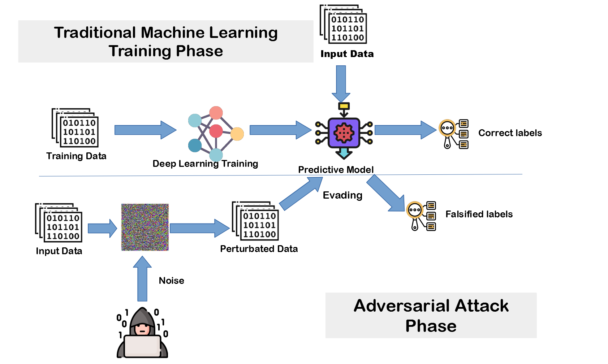

# Adversarial_Attack
The purpose of this repo is to show how to perform an ***adversarial attack*** to Google's image recognition neuronal network **Inceptionv3**. The attack consist on manipulating some pixels of a photo (not appreciable for the human eye, but significant for Inceptionv3) in order to force the neuronal network to fail in the prediction of the manipulated image. We are going to try to manipulate a **computer** photo, so that the Inceptionv3 predicts that it is a **beer**. In terms of doing these pixel manipulations, we are going to use the concept of **gradient** to maximize the cost function (the cost function is the probability of the beer category).

